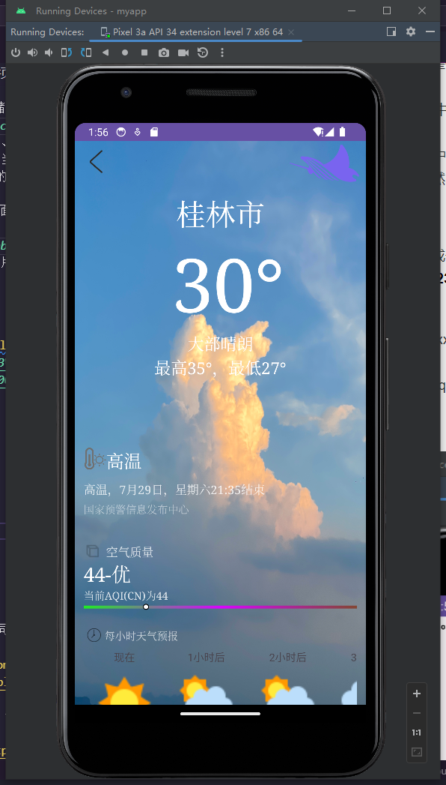
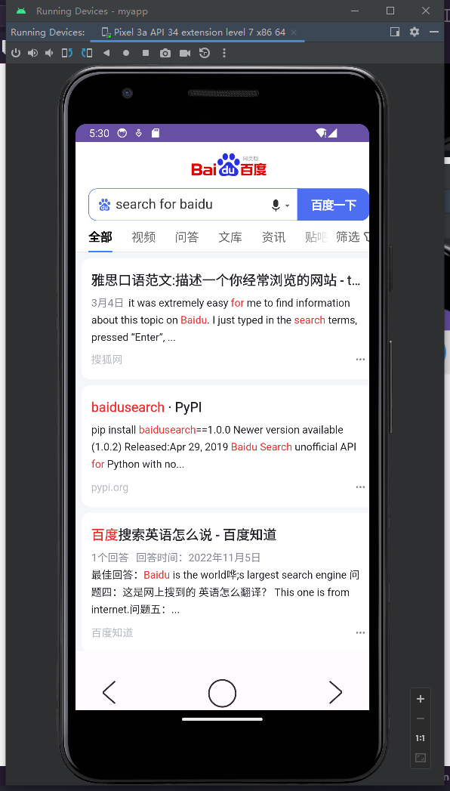
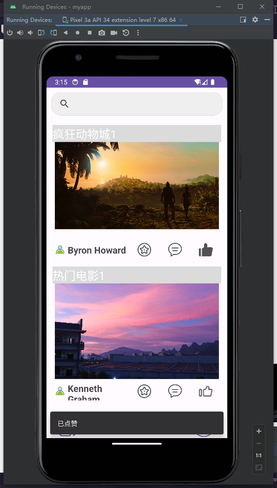
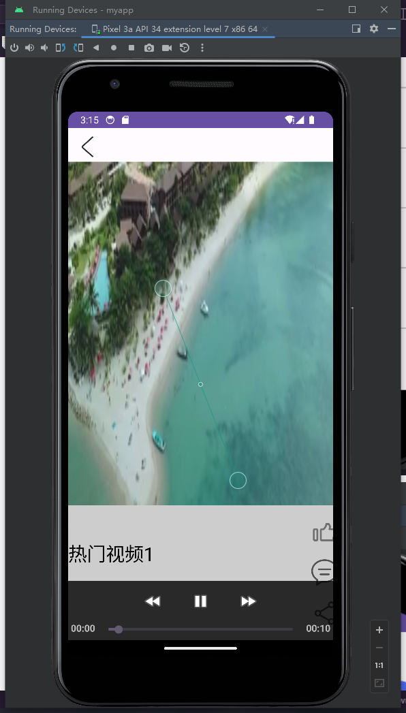
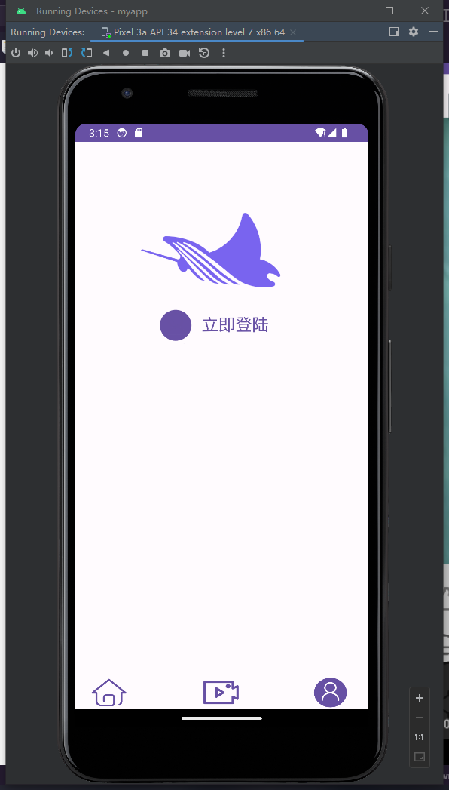
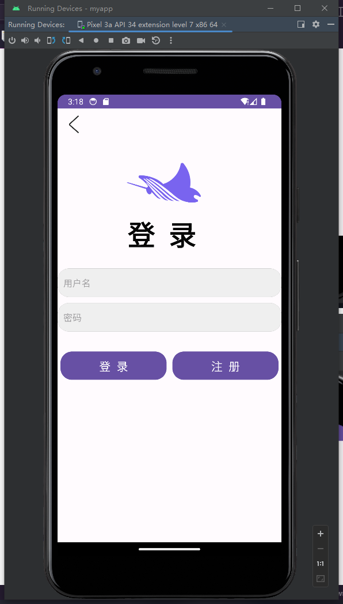
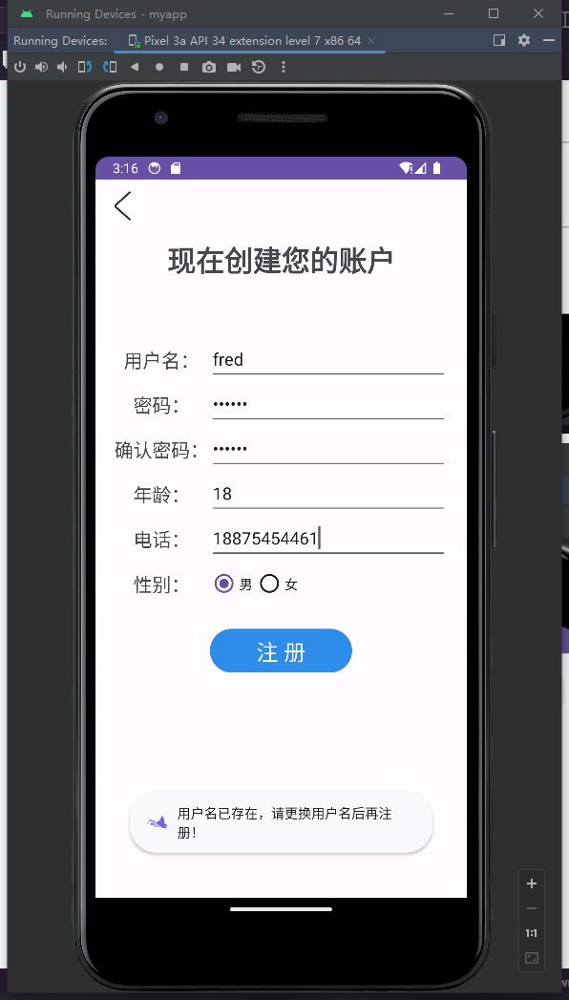
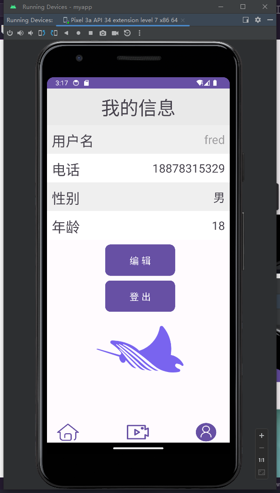
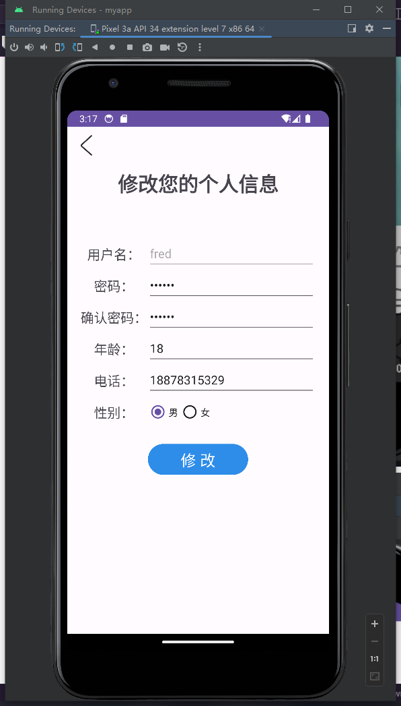

# FinalProject

#### 作者
大二 南京大学 软件工程 211250126 秦含滋
#### 介绍
- 百度移动端大作业
- 由于开始从一个小测试demo开始开发，包名设置成了`com.example.myapp`，待到最后写完才发现包名需要为`com.yourname.app`的形式，也就不想动了，特此说明
- 项目运行图片可见此文档最后

#### 软件架构
软件架构说明

#### 开发过程
- [x] 在电脑上搭建 Android 开发环境（基于 Android Studio）。
  - 创建一个新的 Android App 应用程序，实现相应功能（比如点击logo、icon 会显示一个 Hello 提示框）。
- [x] 参照交互图，完成天气页面开发。
  - 页面可以使用假数据；
  - 每小时天气预报使用横向可滑动的 RecycleView ；
  - 页面打开先展示300ms的 Loading 页面；
- [x] 按照交互图，优化首页样式开发。
  - 中间feed列表使用 RecycleView 来实现（包含有图片`News2`和无图片`News1`）；
  - 左上角天气按钮【渐显】展示；
  - 【可选】天气按钮添加点击事件，跳转到一个新 activity 。
- [x] 按照交互图，完成首页样式开发。
    - 整个页面布局使用 ConstraintLayout 来实现；
    - 页面内容可以灵活使用多种不同布局来实现；
    - 页面中的元素添加点击事件。
- [x] 参考 UE 稿。
  - 完善主页的多tab架构【涉及技术是 Activity、Fragment】；
  - 完成新闻发布器，支持从相册选取图片【涉及技术是 Activity、FileProvider】。
- [x] 参考 UE 稿。
  - 将之前信息流文章内容进行数据持久化保存；
  - 个人设置自我发挥，支持设置自己的个人信息等，将设置的内容持久化。
- [x] 参考 UE 稿。
  - 完成首页视频 tab 页内容，点击条目跳转到视频落地页【涉及技；术：图片加载，可用原生加载方式或第三方图片加载库，如 Glide、Fresco 等】；
  - 完成视频落地页功能，支持视频播放。可使用 MediaPlayer 或第三方播放器。
- [x] 参考 UE 稿。
  - 实现搜索框搜索功能，使用 webview 加载百度首页，实现用户检索浏览，页面前进后退等能力。
- [x] 基于 UE 稿。
  - 实现新闻落地页界面。
#### 安装教程
- 安卓设备可以打开开发者模式直接安装项目 APK 进行预览
- 使用android studio打开、构建、运行项目即可
- 注意安装sdk以及将sdk的路径改为本地路径

#### 使用说明
- 项目导出debug的 apk 地址 
  > ../myapp/app/build/outputs/apk/debug/app-debug.apk
- 项目导出的带签名 apk 地址 
  > ../myapp/app/release/app-release.apk
- 主页的 3 个`fragment`使用一个tab栏进行合格，优化了开始 3 个`activity`的不好实现
- 第一次构建运行项目，需要初始化数据库表 `详情见MainActivity.kt中`，否则数据库内容为空，主页也是空。
- 初始化数据库：依次初始化`News1`、`News2`、`Accounts`数据库。
- 首页 Home 中的新闻可点击进入落地页，查看新闻详情。
- 首页 Home 中的 + 可以添加新闻，当然这里规定了`type == "置顶"`为不带图片的News，`type == "热点"`为带图片的News，添加的时候选择即可，并且支持打开相册选择图片。
- 天气页面则是仿照ios系统的天气页面布局来完成，使用到了当地当天的特定数据作为展示。
- 首页 Home 中的搜索栏则是利用`webView`，结合传参来实现调用百度的搜索功能。
- 首页 Video 中的每个视频的封面图片则是用的随机数据（从本地的三张图内随机选择，当然以后也可做相应拓展）
- 视频落地页也做了相应调整，由于事件以及知识等方面的限制，想模仿抖音的设计，却只能照猫画虎。不过也支持一些相应的互动。
- 不知是由于什么原因，网络图床、视频床的一些url在`VideoView`里面的兼容性并不是太好。项目虽然有3个视频的url，但是`VideoView`里只能正常打开一个，向其他同学询问了一下发现他们也是如此，便不再深究了。
- 首页 User 支持注册登录，以及登录用户登出、编辑个人信息等功能。
- 在注册和编辑个人信息的同时，增加了对于用户名、密码、电话等的约束条件以及提示，这也符合日常人们使用软件的习惯。
- 在一些页面相互退出跳转的地方，笔者也做了一些小小的优化，算是一些有心之举吧。

#### 参与贡献
- 本项目的完成一定程度上参考了[bilibili-2023年百度移动端实战训练营](https://www.bilibili.com/video/BV1KW4y1o7sw/?spm_id_from=333.788&vd_source=21694b6c9f9a10f279227c0070e4ce38)的课程Demo 和 **2023百度移动端实战训练营** 内的优秀作业展示。
1.  Fork 本仓库
2.  新建 Feat_xxx 分支
3.  提交代码
4.  新建 Pull Request

#### 软件页面展示

    

#### 特技

1.  使用 Readme\_XXX.md 来支持不同的语言，例如 Readme\_en.md, Readme\_zh.md
2.  Gitee 官方博客 [blog.gitee.com](https://blog.gitee.com)
3.  你可以 [https://gitee.com/explore](https://gitee.com/explore) 这个地址来了解 Gitee 上的优秀开源项目
4.  [GVP](https://gitee.com/gvp) 全称是 Gitee 最有价值开源项目，是综合评定出的优秀开源项目
5.  Gitee 官方提供的使用手册 [https://gitee.com/help](https://gitee.com/help)
6.  Gitee 封面人物是一档用来展示 Gitee 会员风采的栏目 [https://gitee.com/gitee-stars/](https://gitee.com/gitee-stars/)
